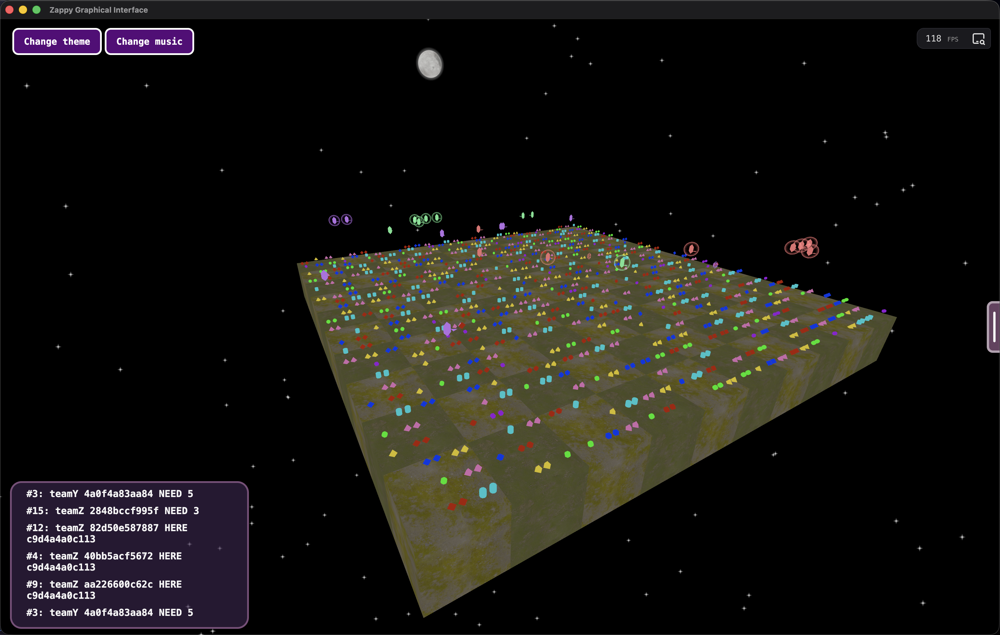
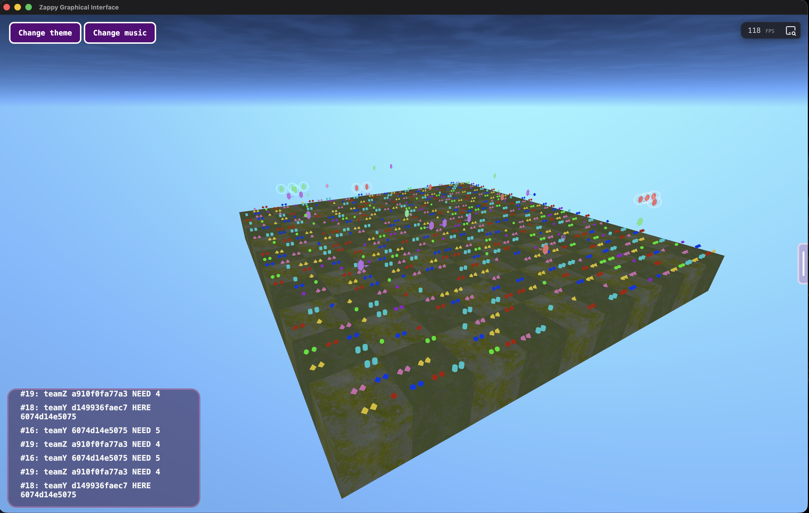

# Zappy

   

**Zappy** is a networking project of the 42 school curriculum.
The goal is to develop a multiplayer, network-based game featuring a server, a graphical interface, and an AI client.

This repository contains our complete implementation, which was completed in 23 days (around 300-350 hours of total group work) and evaluated at **125/100**.

## 👥 The Team

- **[ccharton](https://github.com/XeuWayy) ([42 profile](https://profile.intra.42.fr/users/ccharton))** - AI client & HTML/CSS for the GFX client
- **[epolitze](https://github.com/Emmatosorus) ([42 profile](https://profile.intra.42.fr/users/epolitze))** - GFX client (Three.js/Electron)
- **[mrozniec](https://github.com/M-ROZNIECKI) ([42 profile](https://profile.intra.42.fr/users/mrozniec))** - Server communication with GFX & Server code refactor
- **[mbrement](https://github.com/Mbrement) ([42 profile](https://profile.intra.42.fr/users/mbrement))** - Server communication with AI & Server game management

## 📷 Showcase

<video autoplay loop src='https://github.com/user-attachments/assets/7f63fbb2-d660-496e-8090-d108f95398ed'></video>
*A view of the game in progress.*

|              Dark Theme               |              Light Theme               |
|:-------------------------------------:|:--------------------------------------:|
|  |  |

## 📖 Game Rules & Lore

The game is set on the planet Trantor.
The map is a grid wrapped around itself (a torus), meaning walking off the edge brings you to the opposite side.

The primary goal of a Trantorian is to survive and elevate to the maximum level (Level 8).
- **Survival**: Trantorians must constantly consume food. If their food level drops to zero, they die.
- **Elevation**: To level up, players must perform a ritual. This requires gathering specific quantities of stones (Linemate, Deraumere, Sibur, Mendiane, Phiras, Thystame) and having a specific number of players of the same level on the same tile.

While Trantorians can see, their field of view is initially limited and only expands as they reach higher elevation levels. Because they cannot see across the entire map, they must rely heavily on directional sound broadcasts to communicate, locate teammates, and coordinate their elevation rituals.

# 🛠 Technical Deep Dive

The project is divided into three distinct programs communicating over TCP sockets.
### 1. The Server (`server`)
Written in **Rust** the server is the heart of the game, responsible for map generation, time management, enforcing the rules, and handling all network communication.
- **Single-Threaded Multiplexing**: Per the project requirements, the server operates entirely on a single process and a single thread. We used strict multiplexing to handle concurrent connections from dozens of AI clients, the GFX client, and admins simultaneously without blocking.
- **Command Buffering**: AI commands take different amounts of game time (ticks) to execute. The server accurately buffers up to 10 commands per client and executes them precisely based on the current tick rate.
- **Event Broadcasting**: It efficiently streams game events (movement, resource spawning, broadcasting, incantations) to the graphic client using a custom server-GFX protocol.
### 2. The Graphic Client (`gfx`)
The GFX client acts as a real-time, omniscient observer of the planet Trantor.
- **3D Rendering Engine**: Built entirely with **Three.js**, transforming the server's 2D grid data into a fully interactive 3D world.
- **Desktop Bundling**: Packaged as a standalone desktop application using **Electron**, complete with a login view to easily enter the server's IP and port.
- **UI & Interaction**: Features custom HTML/CSS overlays to display live player statistics, inventory, and tile contents when clicking on specific entities in the 3D space.
- **Immersive Audio**: Integrates an active sound engine that handles game event sound effects and background music playback.

### 3. The AI Client (`client`)
The AI client is an autonomous script that connects to the server and attempts to win the game without human intervention.
- **Standalone Executable**: Bundled using the **Node.js** 25.6.0 experimental Single Executable Application (SEA) feature, allowing it to run smoothly as a single binary.
- **Finite State Machine Architecture**: The brain of the AI relies on a 5-state FSM:
    - **Init**: Connects and announces its presence.
    - **Survival**: Prioritizes finding food to build a safe life buffer.
    - **Farming**: Actively hunts for the specific stones needed for the next elevation level. It will also lay an egg (fork) if more team members are required.
    - **Homing**: Follows the directional sound of a teammate's broadcast to group up.
    - **Elevation**: Initiates the ritual and broadcasts a homing signal every 7 ticks (max 150 attempts) to guide other players to its tile.
- *Performance*: Starting with a single player, the AI typically wins a 10x10 map (1-2 teams) or a 20x20 map (3 teams) in about 2.5 to 3 minutes.

## ⭐ Bonus Features

We implemented several bonus features beyond the mandatory requirements:

- **Live Server Administration**: Connect via socket and authenticate using `ADMIN <PASSWORD>` to access console commands:
    - `tick <NEW_TICKRATE>`: Change the server tickrate live.
    - `kick <ID>`: Disconnect a specific client.
    - `status`: Retrieve server status.
    - `stop`: Gracefully shut down the server.
- **Sound Management**: Integrated sound in both the GFX and AI clients.
- **Theme & Music Picker**: The GFX client features an interface to switch between two distinct visual themes and select background music including Ghost n’ Goblins theme (Amstrad CPC 6128 version).

## 🚀 Installation

### Prerequisites
- **Rust/Cargo** must be installed on your machine to build the server.
- The `Makefile` on Linux/macOS will automatically handle fetching the correct Node version and required packages for the GFX and AI clients.

### Build
To compile the entire project (Server, AI, and GFX), simply run:
```bash
make
````

## 💻 Usage

### 1. Server

```bash
./server -p <port> -x <width> -y <height> -n <team> [<team>]... -c <nb> -t <t> [-s <password>]
```

- `-p`: Port number
- `-x`: World width
- `-y`: World height
- `-n`: Team names (at least one)
- `-c`: Number of clients authorized at the beginning of the game
- `-t`: Time unit divider (the greater `t` is, the faster the game runs)
- `-s`: (Optional) Set the admin password (default is `ADMIN`)

### 2. AI Client

```bash
./client -n <team> -p <port> [-h <hostname>]
```

- `-n`: Team name
- `-p`: Port number
- `-h`: (Optional) Hostname (default is `localhost`)

### 3. Graphic Client (GFX)

You can launch the graphic client via the Makefile:

```bash
make launch_gfx
```

Alternatively, you can run the binary directly from `gfx/out/gfx-OS-CPU_ARCHITECTURE/gfx`. Upon launching, a login window will prompt you to enter the server's IP address and port.
